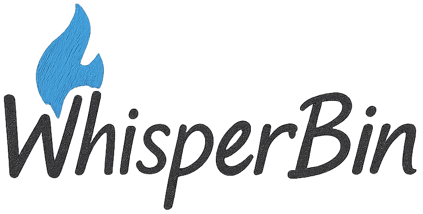
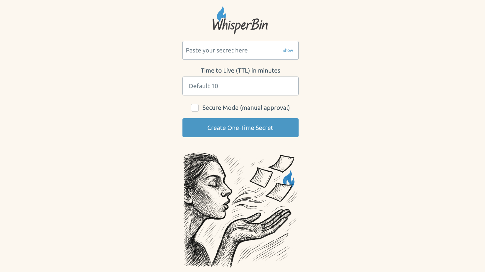

<p align="center">
  
</p>

<p align="center">
  
</p>

## One-Time Secret Sharing Tool for Developers

WhisperBin is a secure web application for sharing short text snippets (such as tokens, SSH keys, or passwords) via links that can be viewed **exactly once**. After retrieval, secrets are deleted automatically.

It is built in Go with server-side rendered HTML templates and optimized for simplicity, privacy, and technical transparency.

---

## Why I built WhisperBin

As a Kotlin developer, I like exploring new programming languages. Go is well suited for building small, fast server applications, and this project was a good way to try it out.

WhisperBin is designed to be lightweight and easy to run, for example on a Raspberry Pi in a home network. I use it to share passwords and other secrets between different devices.

---

## Features

- One-time retrieval (secret deleted on first access)
- Optional secure mode with manual recipient approval (passcode flow)
- Optional TTL (secret expires automatically after a configurable time)
- Encrypted in-memory storage (AES-GCM with per-instance key)
- No database required
- No storage of sensitive logs
- CSRF protection on all forms
- Per-IP rate limiting
- Minimal and clean UI, no JS frameworks required

---

## Usage Flow

1. User submits a secret via `/` form.
2. WhisperBin generates a random ID and stores the encrypted secret in memory.
3. A one-time link is generated: `https://yourhost/{id}`
4. The recipient visits the link:
   - If secure mode is enabled: recipient requests approval with a passcode.
   - Otherwise: secret is shown and immediately deleted.
5. The link is invalid after first use or after TTL expiration.

---

## Tech Stack

- **Backend**: Go (net/http, crypto/rand, html/template)
- **Frontend**: HTML templates (SSR) with [Pico.css](https://picocss.com/) for minimal styling
- **Storage**: In-memory map (sync.Mutex protected)
- **Routing**:
  - `GET /` — Submit secret form
  - `POST /secret` — Store secret
  - `GET /{id}` — Retrieve secret (once)
  - `POST /confirm/{id}` — Manual approval (secure mode)
  - `GET /status/{id}` — Status polling (secure mode)
  - `GET /ws?id={id}` — WebSocket delivery (secure mode)

---

## Security Design

- **Random IDs**: 128-bit, securely generated with `crypto/rand`
- **Encryption**: AES-GCM with per-instance 256-bit key
- **One-time access**: Secret is deleted after first view
- **TTL support**: Expired secrets are automatically purged
- **Secure mode**: Optional manual recipient approval via passcode + WebSocket unlock flow
- **Rate limiting**: Per-IP rate limiting implemented (golang.org/x/time/rate)
- **CSRF**: All forms protected with CSRF tokens
- **No sensitive logging**: No storage of secret content or access logs

---

## Running Locally

```bash
git clone https://github.com/yourusername/whisperbin.git
cd whisperbin
go run ./cmd/whisperbin
```

Access via: [http://localhost:8080](http://localhost:8080)

---

## Build & Deploy

```bash
go build -o whisperbin ./cmd/whisperbin
```

You can deploy WhisperBin behind any reverse proxy with TLS (Nginx, Caddy, etc).

### Docker

A `Dockerfile` is included for building a container image:

```bash
docker build -t whisperbin .
docker run -p 8080:8080 whisperbin
```

You can deploy WhisperBin behind any reverse proxy with TLS (Nginx, Caddy, etc).

---

## Configuration

| Environment Variable | Description                                                                                     |
| -------------------- | ----------------------------------------------------------------------------------------------- |
| `SECRET_KEY`         | Optional 32-byte base64-encoded encryption key. If unset, a random key is generated at startup. |
| `ALLOWED_ORIGIN`     | Allowed origin for WebSocket connections. Default: `http://localhost:8080`.                     |

---

## Project Structure

```
.
├── cmd/whisperbin/main.go          # Main entrypoint
├── internal/storage/               # In-memory storage + encryption logic
├── internal/web/                   # HTTP handlers, templates, CSRF, rate limiting
├── ui/templates/                   # HTML templates
├── ui/static/                      # CSS, favicon, optional images
└── README.md
```

---

## CI / GitHub Actions

This repository includes a GitHub Actions workflow (`.github/workflows/ci_rpi_image.yml`) that builds a **Docker image optimized for Raspberry Pi (ARM architecture)** and can publish it to GitHub Container Registry.

The resulting image runs well on Raspberry Pi 4 and compatible devices.

You can adapt this workflow for your own deployment targets.

---

## Screenshot



---

## Limitations / Disclaimer

WhisperBin is a minimal proof-of-concept for safe sharing of secrets in technical contexts. It is provided **as-is** without warranty. Do not use it for highly sensitive production data without independent security review.

---

## License

MIT License — see [LICENSE](LICENSE) file.
